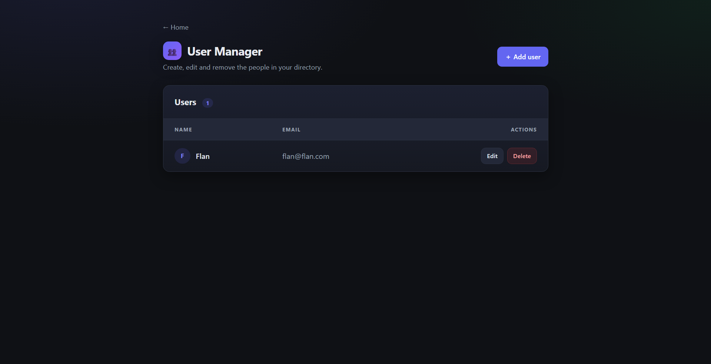
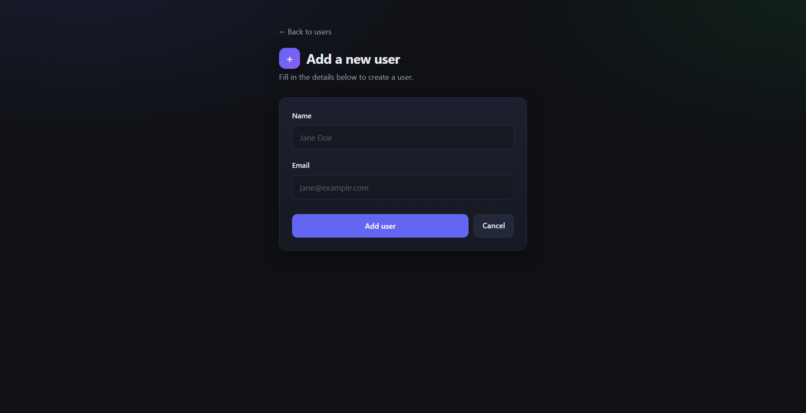
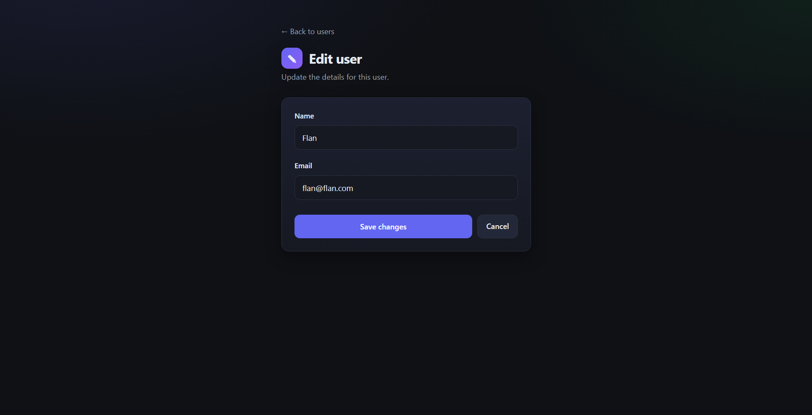

# User Manager

A small Spring Boot web app for managing a directory of users — create, edit and
delete people, each with a **name** and **email**. Server-rendered with Thymeleaf
and backed by MySQL via Spring Data JPA. Ships with a modern dark UI.

## Screenshots

| Home | Users |
|------|-------|
|  |  |

| Add user | Edit user |
|----------|-----------|
|  |  |

## Tech stack

- **Java 17** · **Spring Boot 4.0.6**
- **Spring MVC** + **Thymeleaf** (server-side templates)
- **Spring Data JPA** + **Hibernate**
- **MySQL** (runtime)
- **Bean Validation** (`@NotBlank`)
- **Lombok** · **Spring Boot DevTools**
- **Maven** (wrapper included)

## Project layout

```
src/main/java/com/example/demo/
  DemoApplication.java          # entry point
  controller/UserController.java # routes & form handling
  entities/User.java             # JPA entity (id, name, email)
  repository/UserRepository.java # CrudRepository<User, Long>
src/main/resources/
  templates/                     # home, index, add-user, update-user (Thymeleaf)
  static/css/styles.css          # modern dark theme
  application.properties         # server & datasource config
```

## Routes

| Method | Path             | Purpose                       |
|--------|------------------|-------------------------------|
| GET    | `/`              | Welcome / landing page        |
| GET    | `/users`,`/index`| List all users                |
| GET    | `/signup`        | Show "add user" form          |
| POST   | `/adduser`       | Validate & save a new user    |
| GET    | `/edit/{id}`     | Show edit form for a user     |
| POST   | `/update/{id}`   | Validate & save changes       |
| GET    | `/delete/{id}`   | Delete a user                 |

## Getting started

### Prerequisites

- JDK 17+
- A running MySQL instance with a `thymeleaf` database:

```sql
CREATE DATABASE thymeleaf;
```

Hibernate creates/updates the `user` table automatically on startup
(`spring.jpa.hibernate.ddl-auto=update`).

### Configuration

Edit `src/main/resources/application.properties` if your DB differs from the
defaults:

```properties
server.port=8081
spring.datasource.url=jdbc:mysql://localhost:3306/thymeleaf?serverTimezone=UTC
spring.datasource.username=root
spring.datasource.password=
```

### Run

```bash
./mvnw spring-boot:run
```

Then open **http://localhost:8081/**.

### Build a jar

```bash
./mvnw clean package
java -jar target/demo-0.0.1-SNAPSHOT.jar
```

## Notes

- Form fields are validated; empty name or email shows an inline error.
- The UI theme lives in `static/css/styles.css` and is driven by CSS variables,
  so colors are easy to retheme.
